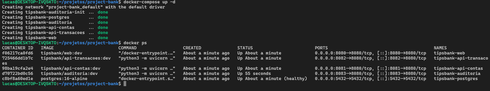
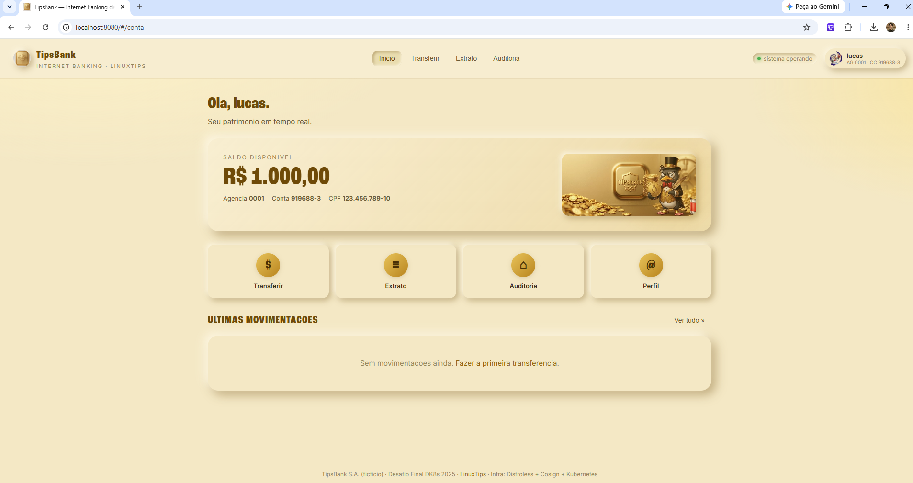

# Evidências Semana 1 — Containers e Cluster

## Inicialização dos containers

* Comando executado: `docker-compose up -d`

* Resultado: todos os serviços iniciados com sucesso.

* Saída do `docker ps`:



## Testes de funcionamento

* Teste via navegador: acesso ao `http://localhost:8080` retornando página inicial da aplicação.



* Teste via terminal:

```bash
curl http://localhost:8080/health
```

## Cluster kubeadm 3 nós (Etapa 1.3)

* Comando executado: `kubectl get nodes -o wide`

* Resultado: cluster kubeadm com 1 control-plane + 2 workers, containerd como runtime, Flannel como CNI, todos os nós em estado Ready na rede privada `192.168.56.0/24`.

* Saída completa: ver `docs/evidencia-cluster-nodes.txt`

```text
NAME          STATUS   ROLES           AGE    VERSION    INTERNAL-IP     EXTERNAL-IP   OS-IMAGE             KERNEL-VERSION       CONTAINER-RUNTIME

k8s-master    Ready    control-plane   5d5h   v1.33.13   192.168.56.10   <none>        Ubuntu 22.04.5 LTS   5.15.0-190-generic   containerd://2.2.1

k8s-worker1   Ready    <none>          5d5h   v1.33.13   192.168.56.11   <none>        Ubuntu 22.04.5 LTS   5.15.0-187-generic   containerd://2.2.1

k8s-worker2   Ready    <none>          5d5h   v1.33.13   192.168.56.12   <none>        Ubuntu 22.04.5 LTS   5.15.0-187-generic   containerd://2.2.1
```

## Etapa 1.2 — Distroless + Trivy + Cosign

### Disponibilização da aplicação no laboratório Vagrant

A aplicação utilizada na etapa de análise foi disponibilizada no ambiente do laboratório Vagrant, ficando acessível nas máquinas virtuais para que o trabalho pudesse ser realizado diretamente dentro do laboratório Kubernetes.

Os arquivos da aplicação foram colocados no ambiente compartilhado utilizado pelo laboratório, ficando disponíveis em:

```text
/vagrant-apps/api-contas
```

Dessa forma, a aplicação `api-contas` pôde ser utilizada dentro das máquinas virtuais do laboratório, incluindo o `k8s-worker2`, onde a imagem foi analisada.

### Passo 1 — Identificação da imagem `api-contas`

Antes de realizar qualquer alteração, foi necessário verificar exatamente qual imagem da API Contas estava armazenada no Docker do `k8s-worker2`.

Comando executado:

```bash
docker images | grep api-contas
```

O comando permitiu identificar a imagem `api-contas:distroless` existente localmente no Docker do `k8s-worker2`.

A identificação da imagem foi registrada como evidência para estabelecer qual imagem estava sendo utilizada antes do início da análise de segurança.

### Passo 2 — Identificação dos metadados da imagem

Após identificar a imagem, foram consultados seus metadados para registrar corretamente o estado inicial da imagem e estabelecer a baseline utilizada na documentação.

Comando executado:

```bash
docker image inspect api-contas:distroless --format 'ID={{.Id}} | Created={{.Created}} | Size={{.Size}}'
```

Foram registrados os seguintes dados:

* ID da imagem;
* data e hora de criação;
* tamanho da imagem.

Resultado obtido:

```text
ID=sha256:97fb20a9a9fa95d63f8a53d559f7bb96ee2fc42ff2709884d366ad4ef97c9a94 | Created=2026-09-02T13:38:30.865298283Z | Size=44945073
```

Com isso, foi possível obter a identidade exata da imagem utilizada como estado inicial da baseline.

### Passo 3 — Verificação do Dockerfile

Com a imagem identificada, foi necessário entender como a aplicação havia sido construída antes de iniciar a análise das vulnerabilidades.

Dentro do diretório da aplicação `api-contas`, foi consultado o Dockerfile:

```bash
cat Dockerfile
```

A análise do Dockerfile permitiu identificar que a construção da imagem utiliza múltiplas etapas.

A primeira etapa é o ambiente `builder`, utilizado para preparar a aplicação e instalar suas dependências:

```dockerfile
FROM python:3.11-slim-bookworm AS builder
```

A etapa final utiliza uma imagem Distroless como ambiente de execução:

```dockerfile
FROM gcr.io/distroless/python3-debian12:nonroot
```

Essa estrutura separa o ambiente utilizado para construção da aplicação do ambiente utilizado para sua execução.

A imagem Distroless é utilizada como ambiente final de execução, sem os componentes normalmente presentes em uma distribuição Linux completa, como shell e gerenciador de pacotes.

### Passo 4 — Identificação das dependências da aplicação

Durante a análise do Dockerfile, foi identificado o uso do arquivo `requirements.txt` para instalação das dependências da aplicação.

Para verificar quais bibliotecas estavam declaradas, foi executado:

```bash
cat requirements.txt
```

Conteúdo utilizado como baseline:

```text
fastapi==0.141.1
uvicorn[standard]==0.30.6
sqlalchemy==2.0.35
psycopg[binary]==3.2.13
pydantic==2.9.2
prometheus-client==0.20.0
bcrypt==4.2.0
```

Essa etapa permitiu identificar as principais dependências declaradas da aplicação antes da análise de vulnerabilidades.

### Passo 5 — Entendimento da construção da imagem Distroless

Antes de analisar as vulnerabilidades, foi necessário entender como a imagem `api-contas:distroless` havia sido construída.

O Dockerfile utiliza uma estratégia multi-stage:

**Primeira etapa — Builder**

```dockerfile
FROM python:3.11-slim-bookworm AS builder
```

Essa etapa é responsável por preparar a aplicação e instalar as dependências necessárias.

**Segunda etapa — Runtime Distroless**

```dockerfile
FROM gcr.io/distroless/python3-debian12:nonroot
```

Essa etapa representa o ambiente final em que a aplicação será executada.

Com isso, foi possível compreender a composição da imagem antes de iniciar a análise de segurança, incluindo a imagem base utilizada no ambiente de construção, a imagem Distroless utilizada no runtime e as dependências declaradas pela aplicação.

### Passo 6 — Varredura inicial com Trivy

Com a imagem identificada e sua estrutura compreendida, foi realizada a primeira análise de vulnerabilidades utilizando o Trivy.

O Trivy já estava instalado no `k8s-worker2`.

Comando executado:

```bash
trivy image api-contas:distroless
```

O comando analisou a imagem `api-contas:distroless` armazenada no Docker do `k8s-worker2` e apresentou as vulnerabilidades encontradas.

O objetivo dessa etapa foi identificar o estado inicial de segurança da imagem antes de qualquer alteração no Dockerfile, nas dependências ou na imagem base.

### Resultado da varredura inicial

Resultado obtido:

```text
Total: 143
UNKNOWN: 5
LOW: 55
MEDIUM: 66
HIGH: 17
CRITICAL: 0
```

Neste primeiro levantamento foram identificadas:

* 143 vulnerabilidades no total;
* 5 vulnerabilidades `UNKNOWN`;
* 55 vulnerabilidades `LOW`;
* 66 vulnerabilidades `MEDIUM`;
* 17 vulnerabilidades `HIGH`;
* 0 vulnerabilidades `CRITICAL`.

O resultado representa a **baseline inicial de segurança** da imagem `api-contas:distroless`.

A partir deste resultado será realizada a análise individual das vulnerabilidades encontradas, principalmente as 17 classificadas como `HIGH`, com o objetivo de determinar:

* quais componentes são responsáveis pelas vulnerabilidades;
* quais possuem versões corrigidas disponíveis;
* quais podem ser corrigidas por atualização;
* quais não possuem correção disponível no momento.

## Ainda pendente (Semana 1)

* Etapa 1.2 — Continuação: análise e mitigação das vulnerabilidades identificadas pelo Trivy e assinatura das imagens com Cosign.
* Etapa 1.4 — Deployments + StatefulSet nos 4 namespaces.
* Etapa 1.5 — ConfigMap + Secret + Pod multicontainer + EmptyDir.
* Etapa 1.6 — PV NFS RWX.
